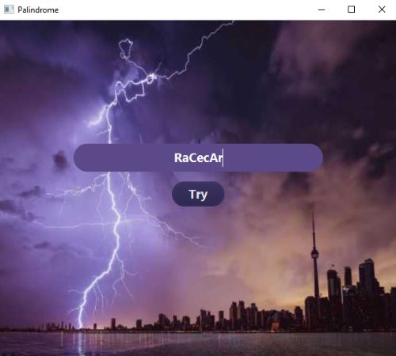
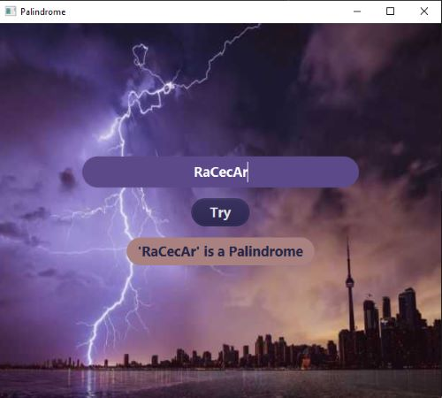

<h1 align="center">Welcome to Palindrome</h1>

<!--  -->

<h4 align="center">
  Javafx: type in a word to test if it is spelled the same forward and backwards.  Clicking on the try button will test if what you entered is a palindrome.  This program uses a recursion method to reverse the order of a string builder.  Then uses a different method comparing the original string builder to the reversed one.
</h4>
 

<h2 align="center" style="text-decoration: underline;">Using this GUI is as follows:</h2>

<h4 align="center">
    1. Click in the textfield to type in a word or phrase.  Capitalization does not matter.

  <!--  -->
</h4>

<h4 align="center">
    2. Press enter on the keyboard or click on the Try button to see if what you typed in is a palindrome.  The display will tell you if it is a palindrome or not.

  <!--  -->
</h4>

<h2 align="center" style="text-decoration: underline;">Errors:</h2>

<h4 align="center">
    1. If the textfield is empty and the Try button is pressed, an error message will be displayed.  Please enter a word or phrase to test.

    <!--  -->
</h4>

<!-- For more details see [GitHub Flavored Markdown](https://guides.github.com/features/mastering-markdown/). -->
<!-- You can use the [editor on GitHub](https://github.com/zuki07/Palindrome/edit/gh-pages/index.md) to maintain and preview the content for your website in Markdown files. -->
